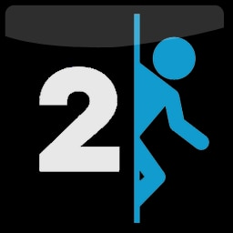
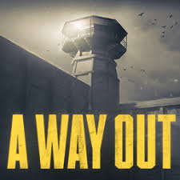
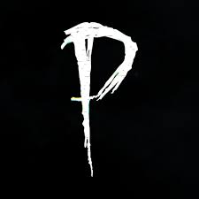
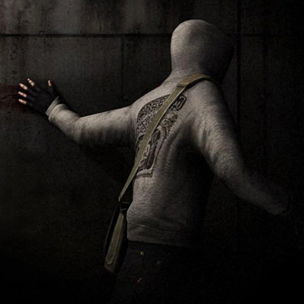

  
  
  

# À propos de moi

## Jeux vidéos favoris

# Sur mon git, vous trouverez

- Des projets liés à l'IUT
- Des projets personnels
- Des anciens jeux vidéos en Python

# Compétences

## Langages :

    

## Outils :

  

## Partage :

  

