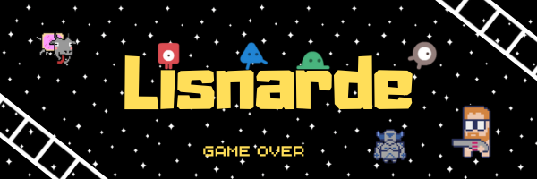
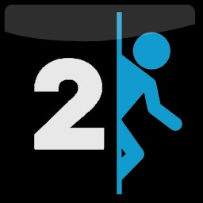
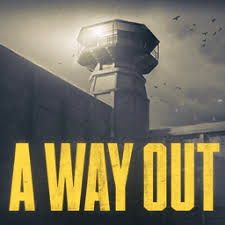
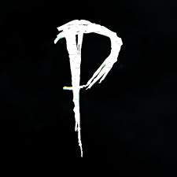
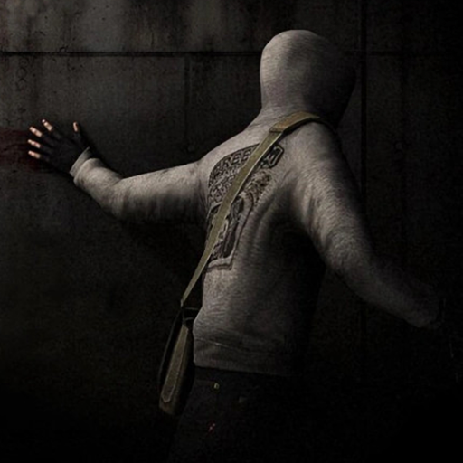

  
  
  

# Sur mon git, vous trouverez

- Des projets liés à l'IUT
- Des projets personnels
- Des anciens jeux vidéos en Python

# Compétences

### Langages :

  

### Développement web :

  

### Outils & Environnements :

  

### Création & Logiciels :

  

### Collaboration :

  

# À propos de moi

## Jeux vidéos favoris

